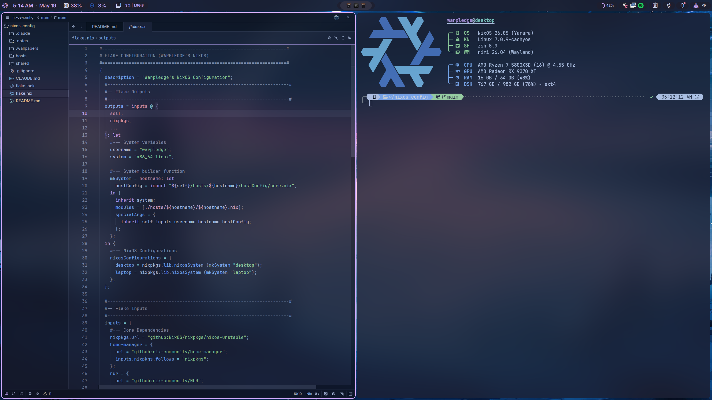
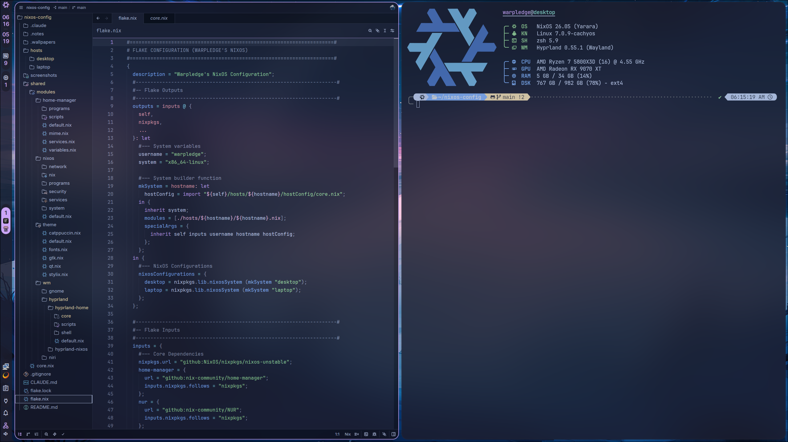

# Warpledge's NixOS Configuration

My personal NixOS system flake, tracking `nixos-unstable`.

## Contents

- [Host Machines](#host-machines)
- [Screenshots](#screenshots)
- [Components](#components)
  - [Desktop Environment](#desktop-environment)
  - [Shell & Terminal](#shell--terminal)
  - [Development](#development)
  - [Applications](#applications)
  - [Gaming](#gaming)
  - [System](#system)
- [Nixy — System Management TUI](#nixy--system-management-tui)
- [Flake Inputs](#flake-inputs)
- [Keybinds](#keybinds)
- [Structure](#structure)
- [History](#history)
- [Inspiration](#inspiration)
- [License](#license)

## Screenshots



<details>
<summary>Hyprland WM</summary>



</details>

## Host Machines

- **Desktop** — Ryzen 5800X3D + RX 9070 XT (AMD-only), 280Hz OLED + 144Hz secondary
- **Laptop** — Legion Slim 5, Ryzen 7735HS + hybrid AMD 680M / RTX 4070, 1600p@165Hz


## Components

Most components below are toggleable per host via `hostConfig` and rebuilding. "Active" marks the one currently selected on my machines; the others are wired up and selectable.

<details>
<summary>Component Details</summary>

### Desktop Environment

| | |
| --- | --- |
| **Window Manager** | [Niri][niri] (active) / [Hyprland][hyprland] |
| **Status Bar / Notifier / Launcher / Lock** | [DankMaterialShell][dms] (Niri + Hyprland) |
| **Display Manager** | [tuigreet][tuigreet] via [greetd][greetd] |
| **Color Scheme** | [Catppuccin][catppuccin] Mocha Mauve applied globally via [Stylix][stylix] + [catppuccin/nix][catppuccin-nix] |
| **Fonts** | [JetBrains Mono Nerd Font][nerd-fonts], Monaspace, Nerd Fonts Symbols |
| **Window Switcher** | [niriswitcher][niriswitcher] (Niri only) |

### Shell & Terminal

| | |
| --- | --- |
| **Shell** | [Zsh][zsh] + [Powerlevel10k][p10k] / [Starship][starship], with [atuin][atuin], [fzf][fzf], [zoxide][zoxide], [eza][eza] |
| **Terminal Emulator** | [Kitty][kitty] (active) / [Ghostty][ghostty] |
| **Multiplexer** | [tmux][tmux] |

### Development

| | |
| --- | --- |
| **Editors / IDE** | [Zed][zed] (active), [Helix][helix], [micro][micro] (quick edits) |
| **Formatter** | [alejandra][alejandra] v3.0.0 |
| **Rebuild Wrapper** | [`nixy`](./shared/modules/home-manager/scripts/nixy.nix) (fzf menu over [nh][nh]) |

### Applications

| | |
| --- | --- |
| **Browsers** | [Zen][zen] / [Mullvad Browser][mullvad-browser] / [Helium][helium] |
| **File Manager** | [Nautilus][nautilus] |
| **Media Player** | [mpv][mpv], [Celluloid][celluloid] (mpv frontend), [Spotify][spotify] via [spicetify-nix][spicetify], [Grayjay][grayjay] |
| **Screenshot / Recording** | [grim][grim] + [slurp][slurp], [gpu-screen-recorder][gpu-screen-recorder] |
| **Creative** | [Blender][blender], [Krita][krita], [Affinity Suite v3][affinity-nix] (via Wine) |
| **Chat / Productivity** | [Vesktop][vesktop] via [nixcord][nixcord] (Vencord), [Thunderbird][thunderbird], [Obsidian][obsidian], [Cohesion][cohesion] |
| **AI Tooling** | [Claude Code][claude-code], [OpenCode][opencode], [LM Studio][lmstudio] |

### Gaming

| | |
| --- | --- |
| **Launchers** | [Steam][steam] (Gamescope), [Heroic][heroic], [Prism Launcher][prismlauncher], [Faugus Launcher][faugus-launcher] |
| **Tools** | [GameMode][gamemode], [MangoHud][mangohud], [Goverlay][goverlay], [r2modman][r2modman], [ProtonPlus][protonplus], [Satisfactory Mod Manager][smm], [AntimicroX][antimicrox], [Rusty PoB][rpob] |
| **Streaming** | [Sunshine][sunshine] |

### System

| | |
| --- | --- |
| **Audio** | [PipeWire][pipewire] (ALSA + PulseAudio compat) |
| **Containers / VMs** | [Docker][docker], [Waydroid][waydroid] (Android), [WinBoat][winboat] (Windows apps) |
| **Flatpak** | [nix-flatpak][nix-flatpak] (declarative Flatpak management) |
| **Networking** | [Mullvad][mullvad] (WireGuard + quantum resistance), [systemd-resolved][resolved] + [NetworkManager][networkmanager] (iwd) |
| **Antivirus** | [ClamAV][clamav] (toggleable) |
| **Keymap Daemon** | [keyd][keyd] |
| **Secrets / Keyring** | [GNOME Keyring][gnome-keyring] |
| **Filesystem & Encryption** | ext4 on a [LUKS][luks]-encrypted partition, unlocked at boot |
| **Bootloader** | [systemd-boot][systemd-boot] |
| **Kernel** | [CachyOS kernel][cachyos-kernel] (selectable: zen / latest / xanmod / cachyos) |

</details>

[niri]: https://github.com/YaLTeR/niri
[hyprland]: https://hyprland.org
[dms]: https://github.com/AvengeMedia/DankMaterialShell
[tuigreet]: https://github.com/apognu/tuigreet
[greetd]: https://git.sr.ht/~kennylevinsen/greetd
[catppuccin]: https://github.com/catppuccin/catppuccin
[catppuccin-nix]: https://github.com/catppuccin/nix
[stylix]: https://github.com/nix-community/stylix
[nerd-fonts]: https://www.nerdfonts.com
[zsh]: https://www.zsh.org
[p10k]: https://github.com/romkatv/powerlevel10k
[starship]: https://starship.rs
[atuin]: https://atuin.sh
[fzf]: https://github.com/junegunn/fzf
[zoxide]: https://github.com/ajeetdsouza/zoxide
[eza]: https://github.com/eza-community/eza
[kitty]: https://sw.kovidgoyal.net/kitty
[ghostty]: https://ghostty.org
[tmux]: https://github.com/tmux/tmux
[zed]: https://zed.dev
[helix]: https://helix-editor.com
[micro]: https://micro-editor.github.io
[zen]: https://zen-browser.app
[mullvad-browser]: https://mullvad.net/en/browser
[helium]: https://github.com/schembriaiden/helium-browser-nix-flake
[nautilus]: https://apps.gnome.org/Nautilus
[mpv]: https://mpv.io
[spotify]: https://www.spotify.com
[spicetify]: https://github.com/Gerg-L/spicetify-nix
[grayjay]: https://grayjay.app
[grim]: https://sr.ht/~emersion/grim
[slurp]: https://github.com/emersion/slurp
[gpu-screen-recorder]: https://git.dec05eba.com/gpu-screen-recorder
[blender]: https://www.blender.org
[krita]: https://krita.org
[affinity-nix]: https://github.com/mrshmllow/affinity-nix
[vesktop]: https://github.com/Vencord/Vesktop
[nixcord]: https://github.com/KaylorBen/nixcord
[thunderbird]: https://www.thunderbird.net
[obsidian]: https://obsidian.md
[cohesion]: https://github.com/brunofin/cohesion
[steam]: https://store.steampowered.com
[heroic]: https://heroicgameslauncher.com
[prismlauncher]: https://prismlauncher.org
[faugus-launcher]: https://github.com/Faugus/faugus-launcher
[gamemode]: https://github.com/FeralInteractive/gamemode
[mangohud]: https://github.com/flightlessmango/MangoHud
[goverlay]: https://github.com/benjamimgois/goverlay
[r2modman]: https://github.com/ebkr/r2modmanPlus
[protonplus]: https://github.com/vysp3r/proton-plus
[smm]: https://github.com/satisfactorymodding/SatisfactoryModManager
[antimicrox]: https://github.com/AntiMicroX/antimicrox
[rpob]: https://pathofbuilding.community
[celluloid]: https://celluloid-player.github.io
[claude-code]: https://github.com/anthropics/claude-code
[opencode]: https://github.com/opencode-ai/opencode
[lmstudio]: https://lmstudio.ai
[docker]: https://www.docker.com
[waydroid]: https://waydro.id
[winboat]: https://github.com/TibixDev/winboat
[mullvad]: https://mullvad.net
[resolved]: https://www.freedesktop.org/software/systemd/man/systemd-resolved.html
[networkmanager]: https://networkmanager.dev
[sunshine]: https://github.com/LizardByte/Sunshine
[clamav]: https://www.clamav.net
[keyd]: https://github.com/rvaiya/keyd
[gnome-keyring]: https://wiki.gnome.org/Projects/GnomeKeyring
[luks]: https://gitlab.com/cryptsetup/cryptsetup
[systemd-boot]: https://www.freedesktop.org/software/systemd/man/systemd-boot.html
[cachyos-kernel]: https://github.com/CachyOS/linux-cachyos
[alejandra]: https://github.com/kamadorueda/alejandra
[nh]: https://github.com/nix-community/nh
[niriswitcher]: https://github.com/isaksamsten/niriswitcher
[pipewire]: https://pipewire.org
[nix-flatpak]: https://github.com/gmodena/nix-flatpak

## Nixy — System Management TUI Script


`nixy` is a custom fzf-driven system management script (defined in [`shared/modules/home-manager/scripts/nixy.nix`](./shared/modules/home-manager/scripts/nixy.nix)). Run it with no arguments for an interactive menu, or pass a command directly.

<details>
<summary>Script Commands</summary>

### NixOS Operations

| Command | Description |
| --- | --- |
| `nixy rebuild` | Apply the current config (`nh os switch`) |
| `nixy upgrade` | Update all flake inputs and rebuild |
| `nixy flake-update` | Update flake inputs without rebuilding |
| `nixy dryrun` | Preview what a rebuild would change |
| `nixy gc` | Garbage collect, keeping last 5 generations |
| `nixy optimize` | Hardlink identical files in the Nix store |
| `nixy rollback` | Switch to a previous system generation |
| `nixy lint` | Run `deadnix` + `statix` to check for unused args and Nix antipatterns |

### System Monitoring

| Command | Description |
| --- | --- |
| `nixy monitor` | Resource monitor (btop) |
| `nixy disk` | Interactive disk usage (ncdu) |
| `nixy health` | Show running and failed systemd services |
| `nixy temps` | Temperature readout (lm_sensors) |

### Network

| Command | Description |
| --- | --- |
| `nixy network` | NetworkManager TUI (nmtui) |
| `nixy speedtest` | Internet speed test |
| `nixy ping` | Quick connectivity check (ping 8.8.8.8) |

### Flatpak

| Command | Description |
| --- | --- |
| `nixy flatpak-update` | Update all Flatpaks |
| `nixy flatpak-list` | List installed Flatpak apps |

### Firmware

| Command | Description |
| --- | --- |
| `nixy firmware-check` | Check for available firmware updates (fwupd) |
| `nixy firmware-update` | Install firmware updates |
| `nixy firmware-devices` | List devices with firmware support |

### AMD GPU

| Command | Description |
| --- | --- |
| `nixy vulkan` | Print Vulkan capabilities (vulkaninfo) |

### Android

| Command | Description |
| --- | --- |
| `nixy debloater` | Launch Universal Android Debloater |

</details>

## Flake Inputs

Key external sources the flake pulls from outside nixpkgs:

<details>
<summary>Flake Inputs</summary>

| Input | Purpose |
| --- | --- |
| [`nixpkgs`](https://github.com/NixOS/nixpkgs) (`nixos-unstable`) | Main package set |
| [`home-manager`](https://github.com/nix-community/home-manager) | User environment management |
| [`nur`](https://github.com/nix-community/NUR) | NixOS User Repository |
| [`niri`](https://github.com/sodiboo/niri-flake) (sodiboo/niri-flake) | Niri WM |
| [`dms`](https://github.com/AvengeMedia/DankMaterialShell) (AvengeMedia, stable) | DankMaterialShell |
| [`stylix`](https://github.com/nix-community/stylix) | System-wide theming |
| [`catppuccin`](https://github.com/catppuccin/nix) | Catppuccin theme module |
| [`nixcord`](https://github.com/kaylorben/nixcord) | Vesktop / Vencord |
| [`spicetify-nix`](https://github.com/gerg-l/spicetify-nix) | Spotify theming |
| [`zen-browser`](https://github.com/0xc000022070/zen-browser-flake) | Zen Browser |
| [`helium`](https://github.com/schembriaiden/helium-browser-nix-flake) | Helium Browser |
| [`cachyos-kernel`](https://github.com/xddxdd/nix-cachyos-kernel) | CachyOS kernel |
| [`nix-flatpak`](https://github.com/gmodena/nix-flatpak) | Declarative Flatpak management |
| [`alejandra`](https://github.com/kamadorueda/alejandra) (pinned 3.0.0) | Nix formatter |
| [`claude-code`](https://github.com/sadjow/claude-code-nix) | Claude Code CLI |
| [`affinity-nix`](https://github.com/mrshmllow/affinity-nix) | Affinity Suite v3 (Photo, Designer, Publisher) via Wine |

</details>

## Keybinds

`Mod` = Super (Windows key). Both WMs share the same intent — only the syntax differs.

>**Note:** `Mod+?` opens a keybind overlay cheatsheet in both WMs.

<details>
<summary>Niri Keybinds</summary>

#### Apps

| Keybind | Action |
| --- | --- |
| `Mod+Return` | Terminal (Kitty) |
| `Mod+Z` | Code editor (Zed) |
| `Mod+B` | Browser (Zen) |
| `Mod+E` | File manager (Nautilus) |
| `Mod+Shift+S` | Steam |
| `Mod+Shift+D` | Discord (Vesktop) |
| `Mod+Shift+H` | Heroic |
| `Mod+Shift+G` | Lutris |
| `Mod+Shift+M` | Spotify |
| `Mod+Shift+Y` | Grayjay |

#### Window Management

| Keybind | Action |
| --- | --- |
| `Mod+Q` | Close window |
| `Mod+Space` | Toggle floating |
| `Mod+F` | Maximize column |
| `Mod+Shift+F` | Fullscreen |
| `Mod+Tab` | Toggle overview |
| `Mod+C` | Center column |
| `Mod+S` | Cycle column width presets |
| `Mod+D` | Expand column to available width |
| `Mod+X` | Cycle window height presets |
| `Mod+Shift+Z` | Reset window height |

#### Focus & Movement

| Keybind | Action |
| --- | --- |
| `Mod+←/→` | Focus column left/right |
| `Mod+↑/↓` | Focus workspace up/down |
| `Mod+Shift+←/→` | Move column left/right |
| `Mod+Scroll` | Focus column left/right |
| `Mod+Shift+Scroll` | Focus workspace up/down |

#### Resize

| Keybind | Action |
| --- | --- |
| `Mod+Ctrl+←/→` | Resize column ±80px |
| `Mod+Ctrl+↑/↓` | Resize window height ±80px |
| `Mod+−/+` | Resize column width ±10% |
| `Mod+Shift+−/+` | Resize window height ±10% |
| `Mod+Alt+1/2/3` | Set column width 33% / 50% / 66% |

#### Workspaces

| Keybind | Action |
| --- | --- |
| `Mod+1–9` | Focus workspace N |
| `Mod+Shift+1–9` | Move window to workspace N |

#### Media & Capture

| Keybind | Action |
| --- | --- |
| `Print` | Area screenshot |
| `Mod+Print` | Window screenshot |
| `Mod+Shift+Print` | Full screen screenshot |
| `Mod+Home` | Start screen recording |
| `Mod+End` | Stop screen recording |

#### Waydroid

| Keybind | Action |
| --- | --- |
| `Mod+Shift+W` | Start Waydroid session |
| `Mod+Ctrl+W` | Stop Waydroid session |

#### Window Switcher

| Keybind | Action |
| --- | --- |
| `Alt+Tab` | Window switcher (niriswitcher) |
| `Alt+\`` | Workspace switcher (niriswitcher) |

</details>

<details>
<summary>Hyprland Keybinds</summary>

#### Apps

| Keybind | Action |
| --- | --- |
| `Super+Return` | Terminal (Kitty) |
| `Super+Z` | Code editor (Zed) |
| `Super+B` | Browser (Zen) |
| `Super+E` | File manager (Nautilus) |
| `Super+Shift+S` | Steam |
| `Super+Shift+D` | Discord (Vesktop) |
| `Super+Shift+H` | Heroic |
| `Super+Shift+G` | Lutris |
| `Super+Shift+M` | Spotify |

#### Window Management

| Keybind | Action |
| --- | --- |
| `Super+Q` | Close window |
| `Super+Space` | Toggle floating |
| `Super+F` | Fullscreen |
| `Super+D` | Maximize |
| `Super+T` | Toggle opacity |
| `Super+0` | Toggle scratchpad |
| `Super+Shift+0` | Move to scratchpad |

#### Focus & Movement

| Keybind | Action |
| --- | --- |
| `Super+←/→/↑/↓` | Focus window in direction |
| `Super+Shift+←/→/↑/↓` | Move window in direction |
| `Super+Scroll` | Scroll through workspaces |

#### Resize & Move

| Keybind | Action |
| --- | --- |
| `Super+Ctrl+←/→/↑/↓` | Resize window ±80px |
| `Super+Alt+←/→/↑/↓` | Move floating window ±80px |
| `Super+LMB drag` | Move window |
| `Super+RMB drag` | Resize window |

#### Workspaces

| Keybind | Action |
| --- | --- |
| `Super+1–9` | Focus workspace N |
| `Super+Shift+1–9` | Move window to workspace N |

#### Media & Capture

| Keybind | Action |
| --- | --- |
| `Print` | Area screenshot → clipboard |
| `Super+Print` | Save screenshot |
| `Super+Shift+Print` | Screenshot with Swappy |

#### Waydroid

| Keybind | Action |
| --- | --- |
| `Super+Shift+W` | Start Waydroid session |
| `Super+Ctrl+W` | Stop Waydroid session |

</details>

## Structure

**Layout** — top-level directories and what lives in each:

```
flake.nix
hosts/{desktop,laptop}/
  ├── hostConfig/core.nix    # per-host toggles
  ├── {hostname}.nix         # host entry
  ├── hardware-configuration.nix
  ├── gpu.nix                # per-host GPU configuration
  └── wm/                    # per-host WM overrides
shared/
  ├── core.nix               # NixOS + home-manager wiring
  └── modules/
      ├── nixos/             # system modules
      ├── home-manager/      # user modules
      ├── theme/             # stylix, catppuccin, fonts, GTK, QT
      └── wm/                # window managers
.notes/                      # personal notes I share between devices
```

**Load order** — how the flake resolves from entry point to active modules:

```
flake.nix
  → hosts/{hostname}/{hostname}.nix             (host entry)
    → hosts/{hostname}/hostConfig/core.nix      (per-host toggles, passed as specialArgs)
    → shared/core.nix                           (NixOS + home-manager integration)
      → shared/modules/{nixos,home-manager}/    (modular configs, conditional imports)
      → shared/modules/wm/${windowManager}/     (active WM only)
```

Each host has a `hostConfig/core.nix` that controls window manager, kernel, browsers, terminals, editors, VPN, Docker, Waydroid, AI tools, and more from one place. Module `default.nix` files use `lib.optionals hostConfig.<option>` to decide what loads — so flipping a single boolean is the whole "enable/disable" workflow.

## History

I've been on NixOS since 2023. Most of what I know I learned by trial and error and referencing other public NixOS config repos, YouTube guides, and hands-on experimentation.

This is iteration 9 of remaking the entire NixOS config from scratch, improving on previous iterations, fixing mistakes, and refining everything to my personal preferences.

## Inspiration

These are the biggest inspirations for my own config and learning NixOS.

- [ryan4yin/nix-config](https://github.com/ryan4yin/nix-config) - has a very useful guide I've referenced many times
- [linuxmobile/shin](https://github.com/linuxmobile/shin) - inspired my switch to Niri WM
- [anotherhadi/nixy](https://github.com/anotherhadi/nixy) - inspiration for the nixy system management TUI script
- [Frost-Phoenix/nixos-config](https://github.com/Frost-Phoenix/nixos-config) - biggest inspiration to get into NixOS overall

## License

MIT — see [LICENSE](./LICENSE).
