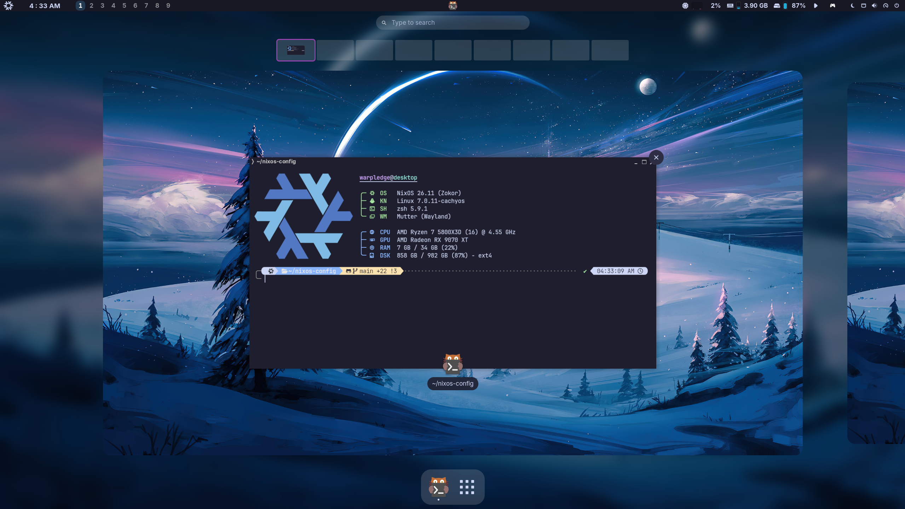
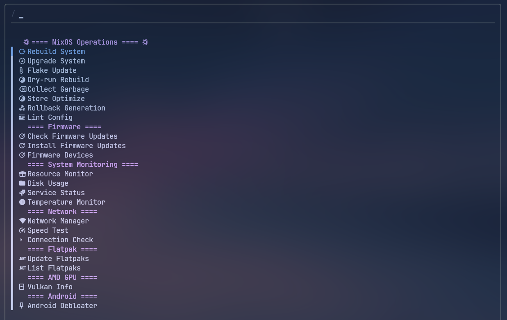

# Warpledge's NixOS Configuration

My personal NixOS system flake.

## Contents

- [Overview](#overview)
- [Screenshots](#screenshots)
- [Host Machines](#host-machines)
- [Components](#components)
  - [Desktop Environment](#desktop-environment)
  - [Shell & Terminal](#shell--terminal)
  - [Development](#development)
  - [Applications](#applications)
  - [Gaming](#gaming)
  - [System](#system)
- [System Management TUI Script](#system-management-tui-script)
- [Shell Shortcuts](#shell-shortcuts)
- [Flake Inputs](#flake-inputs)
- [Keybinds](#keybinds)
- [Structure](#structure)
- [History](#history)
- [Inspiration](#inspiration)
---
## Overview

NixOS is a Linux distribution where the whole system (apps, settings, themes, even keyboard shortcuts) is written out in config files instead of being configured by hand. Building from those files gives you the same system every time, and each build is kept, so if an update breaks something you can boot straight back into the previous one. This repo is that setup for both my machines, a desktop and a laptop, built from one shared set of files.

Some of the highlights:

- **One config, two machines:** both run off the same files. Each machine has its own settings file ([`hostConfig/core.nix`](./hosts/desktop/hostConfig/core.nix)) where I flip features on and off.
- **Easy undo:** if an update breaks something, I roll back to the last version that worked and reboot. No hunting through hidden folders to fix it.
- **One look everywhere:** the whole system shares the same theme ([Catppuccin][catppuccin] Mocha Mauve, set once with [Stylix][stylix]), from the terminal to the browser to regular GTK and Qt apps.
- **Private by default:** full-disk encryption ([LUKS][luks]), [AppArmor][apparmor], a hardened kernel, and a locked-down [Zen][zen] browser using [Arkenfox][arkenfox] and [Securefox][securefox] tweaks.
- **Runs the awkward stuff:** Android apps ([Waydroid][waydroid]), Windows apps ([WinBoat][winboat]), [AppImages][gearlever], Flatpaks ([nix-flatpak][nix-flatpak]), and the normal Linux programs Nix usually won't run ([nix-ld][nix-ld]).
- **Dev setup:** [Docker][docker], [tmux][tmux], [Zed][zed] and [Helix][helix], git with nicer diffs ([delta][delta]) and the [gh][gh] CLI.
- **Built for gaming:** [Steam][steam] with Gamescope support, [GameMode][gamemode] and [MangoHud][mangohud], backed by a few kernel and GPU tweaks to keep things smooth.
- **One menu to run common commands:** I built [`nixm`](./shared/modules/home-manager/scripts/nixm.nix) (short for "nix menu") to put rebuilds, cleanup, rollbacks, and updates behind a single menu, instead of commands I have to remember.
---
## Screenshots

**Niri WM**


**Hyprland WM**


**GNOME WM**



---
## Host Machines

- **Desktop:** Ryzen 5800X3D + RX 9070 XT (AMD-only), 280Hz OLED + 144Hz secondary
- **Laptop:** Legion Slim 5, Ryzen 7735HS + hybrid AMD 680M / RTX 4070, 1600p@165Hz

---

## Components

Most of what's below can be turned on or off per machine from its `hostConfig` file toggles.

### Desktop Environment

| | |
| --- | --- |
| **Window Manager** | [Niri][niri] / [Hyprland][hyprland] / [GNOME][gnome] |
| **Status Bar / Notifier / Launcher / Lock** | [DankMaterialShell][dms] (Niri + Hyprland) / GNOME Shell + extensions (GNOME) |
| **Display Manager** | [tuigreet][tuigreet] via [greetd][greetd] (Niri/Hyprland) / [GDM][gdm] (GNOME) |
| **Color Scheme** | [Catppuccin][catppuccin] Mocha Mauve applied globally via [Stylix][stylix] + [catppuccin/nix][catppuccin-nix] |
| **Fonts** | [JetBrains Mono Nerd Font][nerd-fonts], Monaspace, Nerd Fonts Symbols |
| **Window Switcher** | [niriswitcher][niriswitcher] (Niri only) |
| **GNOME Extensions** | [Dash to Panel][dash-to-panel], [Blur my Shell][blur-my-shell], [AppIndicator][appindicator], [Astra Monitor][astra-monitor], [Caffeine][caffeine], [Auto Move Windows][auto-move-windows], [GNOME UI Tune][gnome-ui-tune], [Space Bar][space-bar], [Date Menu Formatter][date-menu-formatter] |

### Shell & Terminal

| | |
| --- | --- |
| **Shell** | [Zsh][zsh] + [Powerlevel10k][p10k] / [Starship][starship], with [atuin][atuin], [fzf][fzf], [zoxide][zoxide], [eza][eza] |
| **Terminal Emulator** | [Kitty][kitty] / [Ghostty][ghostty] |
| **Terminal Multiplexer** | [tmux][tmux] (run many terminals in one window) |
| **Quick Run** | `run <pkg>`: try a package one time without installing it (`nix run` wrapper) |

### Development

| | |
| --- | --- |
| **Editors / IDE** | [Zed][zed], [Helix][helix], [micro][micro] (quick edits) |
| **Formatter** | [alejandra][alejandra] v3.0.0 |
| **Rebuild Wrapper** | [`nixm`](./shared/modules/home-manager/scripts/nixm.nix) (fzf menu over [nh][nh]) |

### Applications

| | |
| --- | --- |
| **Browsers** | [Zen][zen] / [Mullvad Browser][mullvad-browser] / [Helium][helium] |
| **File Manager** | [Nautilus][nautilus] |
| **Media Player** | [mpv][mpv], [Celluloid][celluloid] (mpv frontend), [Spotify][spotify] via [spicetify-nix][spicetify], [Grayjay][grayjay] |
| **Screenshot / Recording** | [grim][grim] + [slurp][slurp], [gpu-screen-recorder][gpu-screen-recorder] |
| **Creative** | [Blender][blender], [Krita][krita], [Affinity Suite v3][affinity-nix] (via Wine) |
| **Chat / Productivity** | [Vesktop][vesktop] via [nixcord][nixcord] (Vencord), [Thunderbird][thunderbird], [Obsidian][obsidian], [Cohesion][cohesion] |
| **AI Tooling** | [Claude Code][claude-code], [OpenCode][opencode], [LM Studio][lmstudio] |

### Gaming

| | |
| --- | --- |
| **Launchers** | [Steam][steam] (Gamescope), [Heroic][heroic], [Prism Launcher][prismlauncher], [Faugus Launcher][faugus-launcher], [Lutris][lutris] |
| **Tools** | [GameMode][gamemode], [MangoHud][mangohud], [Goverlay][goverlay], [r2modman][r2modman], [ProtonPlus][protonplus], [Satisfactory Mod Manager][smm], [AntimicroX][antimicrox], [Rusty PoB][rpob] |
| **Streaming** | [Sunshine][sunshine] |

### System

| | |
| --- | --- |
| **Audio** | [PipeWire][pipewire] (ALSA + PulseAudio compat) |
| **Containers / VMs** | [Docker][docker], [Waydroid][waydroid] (Android), [WinBoat][winboat] (Windows apps) |
| **Flatpak** | [nix-flatpak][nix-flatpak] (declarative Flatpak management) |
| **Networking** | [Mullvad][mullvad] (encrypted VPN, WireGuard), [systemd-resolved][resolved] + [NetworkManager][networkmanager] (iwd) |
| **Antivirus** | [ClamAV][clamav] (toggleable) |
| **Key Remapping** | [keyd][keyd] |
| **Secrets / Keyring** | [GNOME Keyring][gnome-keyring] |
| **Filesystem & Encryption** | ext4 on a [LUKS][luks]-encrypted partition, unlocked at boot |
| **Bootloader** | [systemd-boot][systemd-boot] |
| **Kernel** | [CachyOS kernel][cachyos-kernel] (selectable: zen / latest / xanmod / cachyos) |

[niri]: https://github.com/YaLTeR/niri
[hyprland]: https://hyprland.org
[gnome]: https://www.gnome.org
[gdm]: https://wiki.gnome.org/Projects/GDM
[dash-to-panel]: https://github.com/home-sweet-gnome/dash-to-panel
[blur-my-shell]: https://github.com/aunetx/blur-my-shell
[appindicator]: https://github.com/ubuntu/gnome-shell-extension-appindicator
[astra-monitor]: https://github.com/AstraExt/astra-monitor
[caffeine]: https://github.com/eonpatapon/gnome-shell-extension-caffeine
[auto-move-windows]: https://gitlab.gnome.org/GNOME/gnome-shell-extensions
[gnome-ui-tune]: https://github.com/somepaulo/gnome-ui-tune
[space-bar]: https://github.com/luchrioh/space-bar
[date-menu-formatter]: https://github.com/marcinjakubowski/date-menu-formatter
[dms]: https://github.com/AvengeMedia/DankMaterialShell
[tuigreet]: https://github.com/apognu/tuigreet
[greetd]: https://git.sr.ht/~kennylevinsen/greetd
[catppuccin]: https://github.com/catppuccin/catppuccin
[catppuccin-nix]: https://github.com/catppuccin/nix
[stylix]: https://github.com/nix-community/stylix
[nerd-fonts]: https://www.nerdfonts.com
[zsh]: https://www.zsh.org
[p10k]: https://github.com/romkatv/powerlevel10k
[starship]: https://starship.rs
[atuin]: https://atuin.sh
[fzf]: https://github.com/junegunn/fzf
[zoxide]: https://github.com/ajeetdsouza/zoxide
[eza]: https://github.com/eza-community/eza
[kitty]: https://sw.kovidgoyal.net/kitty
[ghostty]: https://ghostty.org
[tmux]: https://github.com/tmux/tmux
[zed]: https://zed.dev
[helix]: https://helix-editor.com
[micro]: https://micro-editor.github.io
[zen]: https://zen-browser.app
[mullvad-browser]: https://mullvad.net/en/browser
[helium]: https://github.com/schembriaiden/helium-browser-nix-flake
[nautilus]: https://apps.gnome.org/Nautilus
[mpv]: https://mpv.io
[spotify]: https://www.spotify.com
[spicetify]: https://github.com/Gerg-L/spicetify-nix
[grayjay]: https://grayjay.app
[grim]: https://sr.ht/~emersion/grim
[slurp]: https://github.com/emersion/slurp
[gpu-screen-recorder]: https://git.dec05eba.com/gpu-screen-recorder
[blender]: https://www.blender.org
[krita]: https://krita.org
[affinity-nix]: https://github.com/mrshmllow/affinity-nix
[vesktop]: https://github.com/Vencord/Vesktop
[nixcord]: https://github.com/KaylorBen/nixcord
[thunderbird]: https://www.thunderbird.net
[obsidian]: https://obsidian.md
[cohesion]: https://github.com/brunofin/cohesion
[steam]: https://store.steampowered.com
[heroic]: https://heroicgameslauncher.com
[prismlauncher]: https://prismlauncher.org
[faugus-launcher]: https://github.com/Faugus/faugus-launcher
[gamemode]: https://github.com/FeralInteractive/gamemode
[mangohud]: https://github.com/flightlessmango/MangoHud
[goverlay]: https://github.com/benjamimgois/goverlay
[r2modman]: https://github.com/ebkr/r2modmanPlus
[protonplus]: https://github.com/vysp3r/proton-plus
[smm]: https://github.com/satisfactorymodding/SatisfactoryModManager
[antimicrox]: https://github.com/AntiMicroX/antimicrox
[lutris]: https://lutris.net
[rpob]: https://pathofbuilding.community
[celluloid]: https://celluloid-player.github.io
[claude-code]: https://github.com/anthropics/claude-code
[opencode]: https://github.com/opencode-ai/opencode
[lmstudio]: https://lmstudio.ai
[docker]: https://www.docker.com
[waydroid]: https://waydro.id
[winboat]: https://github.com/TibixDev/winboat
[mullvad]: https://mullvad.net
[resolved]: https://www.freedesktop.org/software/systemd/man/systemd-resolved.html
[networkmanager]: https://networkmanager.dev
[sunshine]: https://github.com/LizardByte/Sunshine
[clamav]: https://www.clamav.net
[keyd]: https://github.com/rvaiya/keyd
[gnome-keyring]: https://wiki.gnome.org/Projects/GnomeKeyring
[luks]: https://gitlab.com/cryptsetup/cryptsetup
[systemd-boot]: https://www.freedesktop.org/software/systemd/man/systemd-boot.html
[cachyos-kernel]: https://github.com/CachyOS/linux-cachyos
[alejandra]: https://github.com/kamadorueda/alejandra
[nh]: https://github.com/nix-community/nh
[niriswitcher]: https://github.com/isaksamsten/niriswitcher
[pipewire]: https://pipewire.org
[nix-flatpak]: https://github.com/gmodena/nix-flatpak
[apparmor]: https://apparmor.net
[arkenfox]: https://github.com/arkenfox/user.js
[securefox]: https://github.com/yokoffing/Betterfox
[gearlever]: https://github.com/mijorus/gearlever
[nix-ld]: https://github.com/nix-community/nix-ld
[delta]: https://github.com/dandavison/delta
[gh]: https://cli.github.com
[gamescope]: https://github.com/ValveSoftware/gamescope

---
## System Management TUI Script



`nixm` is the script I use to manage the system day to day (it lives in [`shared/modules/home-manager/scripts/nixm.nix`](./shared/modules/home-manager/scripts/nixm.nix)). Run it on its own and you get the menu below; pass it a command and it skips straight to that. It started from a script in [anotherhadi's NixOS config](https://github.com/anotherhadi/nixy), but I've reworked and extended it a lot since.

### NixOS Operations

| Command | Description |
| --- | --- |
| `nixm rebuild` | Apply the current config (`nh os switch`) |
| `nixm upgrade` | Update all flake inputs and rebuild |
| `nixm flake-update` | Update flake inputs without rebuilding |
| `nixm dryrun` | Preview what a rebuild would change |
| `nixm gc` | Garbage collect, keeping last 5 generations |
| `nixm optimize` | Hardlink identical files in the Nix store |
| `nixm rollback` | Switch to a previous system generation |
| `nixm lint` | Run `deadnix` + `statix` to check for unused args and Nix antipatterns |

### System Monitoring

| Command | Description |
| --- | --- |
| `nixm monitor` | Resource monitor (btop) |
| `nixm disk` | Interactive disk usage (ncdu) |
| `nixm health` | Show running and failed systemd services |
| `nixm temps` | Temperature readout (lm_sensors) |

### Network

| Command | Description |
| --- | --- |
| `nixm network` | NetworkManager TUI (nmtui) |
| `nixm speedtest` | Internet speed test |
| `nixm ping` | Quick connectivity check (ping 8.8.8.8) |

### Flatpak

| Command | Description |
| --- | --- |
| `nixm flatpak-update` | Update all Flatpaks |
| `nixm flatpak-list` | List installed Flatpak apps |

### Firmware

| Command | Description |
| --- | --- |
| `nixm firmware-check` | Check for available firmware updates (fwupd) |
| `nixm firmware-update` | Install firmware updates |
| `nixm firmware-devices` | List devices with firmware support |

### AMD GPU

| Command | Description |
| --- | --- |
| `nixm vulkan` | Print Vulkan capabilities (vulkaninfo) |

### Android

| Command | Description |
| --- | --- |
| `nixm debloater` | Launch Universal Android Debloater |

---
## Shell Shortcuts

Short commands I use in place of longer ones, all set up in [`zsh.nix`](./shared/modules/home-manager/programs/shell/zsh.nix). The ones marked _(fn)_ take an argument.

### Editors & Files

| Shortcut | Runs |
| --- | --- |
| `v` / `vi` / `vim` | `nvim` |
| `nano` | `micro` |
| `zed` | `zeditor` |
| `cat` | `bat` |
| `ls` / `l` / `ll` | `eza` (icons, listing variants) |
| `tree` | `eza --tree` |
| `y` | `yazi` file manager |
| `fm` _(fn)_ | open `yazi`, then `cd` to where you left it |
| `fcd` _(fn)_ | fuzzy-find a directory and `cd` into it |
| `open <file>` | `xdg-open` |
| `icat ` | preview an image in Kitty |

### Navigation

| Shortcut | Runs |
| --- | --- |
| `cd` | `z` (zoxide smart jump) |
| `temp` | `cd /tmp` |
| `cdnix` | open `~/nixos-config` in Zed |

### Git

| Shortcut | Runs |
| --- | --- |
| `g` | `lazygit` |
| `ga` | `git add` |
| `gc` / `gcm` | `git commit` / `git commit -m` |
| `gcu` | `git add . && git commit -m 'Update'` |
| `gp` / `gpl` | `git push` / `git pull` |
| `gs` / `gd` | `git status` / `git diff` |
| `gco` / `gcb` | `git checkout` / `git checkout -b` |
| `gbr` | `git branch` |

### Nix

| Shortcut | Runs |
| --- | --- |
| `run <pkg>` _(fn)_ | try a package once without installing it (`nix run nixpkgs#<pkg>`) |
| `cleanup` | garbage-collect generations older than 1 day |
| `listgen` | list system generations |
| `bloat` | show current system closure size |

### System & Misc

| Shortcut | Runs |
| --- | --- |
| `c` / `e` | `clear` / `exit` |
| `grep` | `rg` (ripgrep) |
| `us` / `rs` | `systemctl --user` / `sudo systemctl` |
| `cleanram` | drop filesystem caches |
| `trimall` | `fstrim` all mounts |
| `fetch` | `fastfetch` |
| `notes` / `note` | open notes in nvim |
| `anime` | `ani-cli` |
| `f` | `figlet` |

---
## Flake Inputs

The main things this config pulls in from outside the standard NixOS package set:

| Input | Purpose |
| --- | --- |
| [`nixpkgs`](https://github.com/NixOS/nixpkgs) (`nixos-unstable`) | Main package set |
| [`home-manager`](https://github.com/nix-community/home-manager) | User environment management |
| [`nur`](https://github.com/nix-community/NUR) | NixOS User Repository |
| [`niri`](https://github.com/sodiboo/niri-flake) (sodiboo/niri-flake) | Niri WM |
| [`dms`](https://github.com/AvengeMedia/DankMaterialShell) (AvengeMedia, stable) | DankMaterialShell |
| [`stylix`](https://github.com/nix-community/stylix) | System-wide theming |
| [`catppuccin`](https://github.com/catppuccin/nix) | Catppuccin theme module |
| [`nixcord`](https://github.com/kaylorben/nixcord) | Vesktop / Vencord |
| [`spicetify-nix`](https://github.com/gerg-l/spicetify-nix) | Spotify theming |
| [`zen-browser`](https://github.com/0xc000022070/zen-browser-flake) | Zen Browser |
| [`helium`](https://github.com/schembriaiden/helium-browser-nix-flake) | Helium Browser |
| [`cachyos-kernel`](https://github.com/xddxdd/nix-cachyos-kernel) | CachyOS kernel |
| [`nix-flatpak`](https://github.com/gmodena/nix-flatpak) | Declarative Flatpak management |
| [`alejandra`](https://github.com/kamadorueda/alejandra) (pinned 3.0.0) | Nix formatter |
| [`claude-code`](https://github.com/sadjow/claude-code-nix) | Claude Code CLI |
| [`affinity-nix`](https://github.com/mrshmllow/affinity-nix) | Affinity Suite v3 (Photo, Designer, Publisher) via Wine |

---
## Keybinds

`Mod` is the Super (Windows) key. Both window managers do the same things; only the way the binds are written differs.

>**Note:** `Mod+?` opens a keybind overlay cheatsheet in both WMs.

<details>
<summary>Niri Keybinds (click to expand)</summary>

#### Apps

| Keybind | Action |
| --- | --- |
| `Mod+Return` | Terminal (Kitty) |
| `Mod+Z` | Code editor (Zed) |
| `Mod+B` | Browser (Zen) |
| `Mod+E` | File manager (Nautilus) |
| `Mod+Shift+S` | Steam |
| `Mod+Shift+D` | Discord (Vesktop) |
| `Mod+Shift+H` | Heroic |
| `Mod+Shift+G` | Lutris |
| `Mod+Shift+M` | Spotify |
| `Mod+Shift+Y` | Grayjay |

#### Window Management

| Keybind | Action |
| --- | --- |
| `Mod+Q` | Close window |
| `Mod+Space` | Toggle floating |
| `Mod+F` | Maximize column |
| `Mod+Shift+F` | Fullscreen |
| `Mod+Tab` | Toggle overview |
| `Mod+C` | Center column |
| `Mod+S` | Cycle column width presets |
| `Mod+D` | Expand column to available width |
| `Mod+X` | Cycle window height presets |

#### Focus & Movement

| Keybind | Action |
| --- | --- |
| `Mod+←/→` | Focus column left/right |
| `Mod+↑/↓` | Focus workspace up/down |
| `Mod+Shift+←/→` | Move column left/right |
| `Mod+Scroll` | Focus column left/right |
| `Mod+Shift+Scroll` | Focus workspace up/down |

#### Resize

| Keybind | Action |
| --- | --- |
| `Mod+Ctrl+←/→` | Resize column ±80px |
| `Mod+Ctrl+↑/↓` | Resize window height ±80px |
| `Mod+−/+` | Resize column width ±10% |
| `Mod+Shift+−/+` | Resize window height ±10% |
| `Mod+Alt+1/2/3` | Set column width 33% / 50% / 66% |

#### Workspaces

| Keybind | Action |
| --- | --- |
| `Mod+1–9` | Focus workspace N |
| `Mod+Shift+1–9` | Move window to workspace N |

#### Media & Capture

| Keybind | Action |
| --- | --- |
| `Print` | Area screenshot |
| `Mod+Print` | Window screenshot |
| `Mod+Shift+Print` | Full screen screenshot |
| `Mod+Home` | Start screen recording |
| `Mod+End` | Stop screen recording |

#### Waydroid

| Keybind | Action |
| --- | --- |
| `Mod+Shift+W` | Start Waydroid session |
| `Mod+Ctrl+W` | Stop Waydroid session |

#### Window Switcher

| Keybind | Action |
| --- | --- |
| `Alt+Tab` | Window switcher (niriswitcher) |
| `Alt+Tilde` | Workspace switcher (niriswitcher) |

</details>

<details>
<summary>Hyprland Keybinds (click to expand)</summary>

#### Apps

| Keybind | Action |
| --- | --- |
| `Mod+Return` | Terminal (Kitty) |
| `Mod+Z` | Code editor (Zed) |
| `Mod+B` | Browser (Zen) |
| `Mod+E` | File manager (Nautilus) |
| `Mod+Shift+S` | Steam |
| `Mod+Shift+D` | Discord (Vesktop) |
| `Mod+Shift+H` | Heroic |
| `Mod+Shift+G` | Lutris |
| `Mod+Shift+M` | Spotify |
| `Mod+Shift+Y` | Grayjay |

#### Window Management

| Keybind | Action |
| --- | --- |
| `Mod+Q` | Close window |
| `Mod+Space` | Toggle floating |
| `Mod+F` | Fullscreen |
| `Mod+D` | Maximize |
| `Mod+T` | Toggle opacity |
| `Mod+0` | Toggle scratchpad |
| `Mod+Shift+0` | Move to scratchpad |

#### Focus & Movement

| Keybind | Action |
| --- | --- |
| `Mod+←/→/↑/↓` | Focus window in direction |
| `Mod+Shift+←/→/↑/↓` | Move window in direction |
| `Mod+Scroll` | Scroll through workspaces |

#### Resize & Move

| Keybind | Action |
| --- | --- |
| `Mod+Ctrl+←/→/↑/↓` | Resize window ±80px |
| `Mod+Alt+←/→/↑/↓` | Move floating window ±80px |
| `Mod+LMB drag` | Move window |
| `Mod+RMB drag` | Resize window |

#### Workspaces

| Keybind | Action |
| --- | --- |
| `Mod+1–9` | Focus workspace N |
| `Mod+Shift+1–9` | Move window to workspace N |

#### Media & Capture

| Keybind | Action |
| --- | --- |
| `Print` | Area screenshot → clipboard |
| `Mod+Print` | Save screenshot |
| `Mod+Shift+Print` | Screenshot with Swappy |

#### Waydroid

| Keybind | Action |
| --- | --- |
| `Mod+Shift+W` | Start Waydroid session |
| `Mod+Ctrl+W` | Stop Waydroid session |

</details>

---
## Structure

**Layout:** top-level directories and what lives in each:

```
flake.nix
hosts/{desktop,laptop}/
  ├── hostConfig/core.nix         # per-host toggles
  ├── {hostname}.nix              # host entry
  ├── hardware-configuration.nix  # system specific hardware configuration
  ├── gpu.nix                     # per-host GPU configuration
  └── wm/                         # per-host WM overrides
shared/
  ├── core.nix                    # NixOS + home-manager wiring
  └── modules/
      ├── nixos/                  # system modules
      ├── home-manager/           # user modules
      ├── theme/                  # stylix, catppuccin, fonts, GTK, QT
      └── wm/                     # window managers
.notes/                           # personal notes I share between devices
```

**How it loads:** the flake picks a machine, reads that machine's on/off switches, then pulls in only the modules those switches enable:

```
flake.nix
  → hosts/{hostname}/{hostname}.nix             # Pick the machine
    → hosts/{hostname}/hostConfig/core.nix      # Read its on/off switches
    → shared/core.nix                           # Wire up system + user config
      → shared/modules/{nixos,home-manager}/    # Load only the enabled modules
      → shared/modules/wm/${windowManager}/     # Load only the active window manager
```

Each host's `hostConfig/core.nix` is the single place that turns features on or off: window manager, kernel, browsers, terminals, editors, and services.

---
## History

I've been on NixOS since 2022. Most of what I know came from trial and error, other public NixOS configs, YouTube guides, and hands-on experimentation.

This is iteration 9 of remaking the entire NixOS config from scratch.

---
## Inspiration

These are the biggest inspirations for my own config and learning NixOS.

- [ryan4yin/nix-config](https://github.com/ryan4yin/nix-config) 
- [linuxmobile/shin](https://github.com/linuxmobile/shin) 
- [anotherhadi/nixy](https://github.com/anotherhadi/nixy)
- [Frost-Phoenix/nixos-config](https://github.com/Frost-Phoenix/nixos-config)
