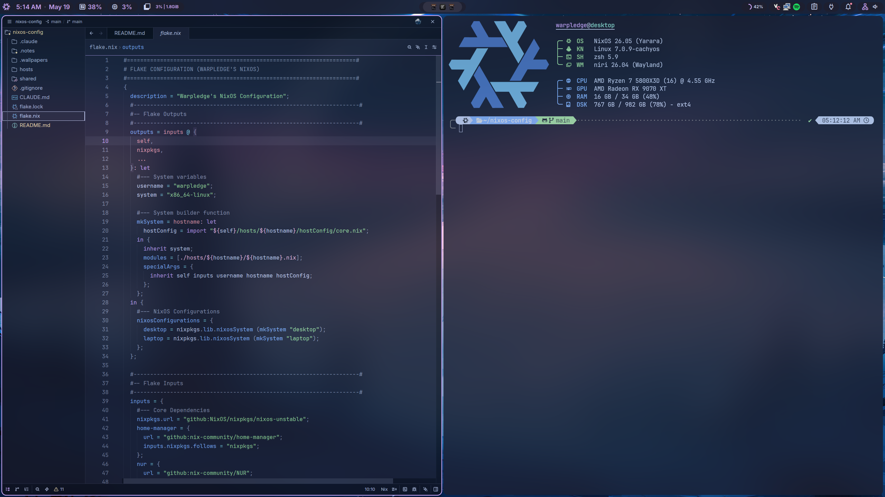
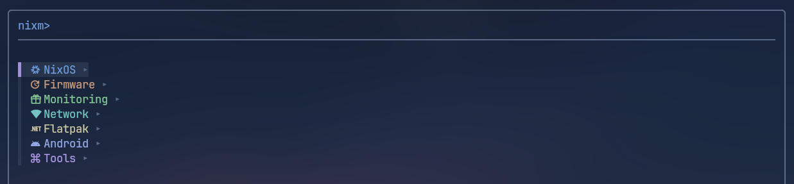
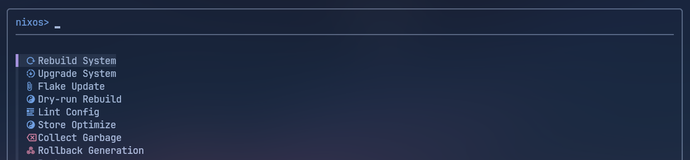

# Warpledge's NixOS Configuration

The NixOS configuration behind my desktop and laptop, both daily driven since 2022.

Everything here is shaped around these two machines and how I use them, so cloning the repo and running it won't get you far. It works better as a reference: a look at how a whole setup fits together, and somewhere to borrow an idea or a module from.

New to NixOS? The short version: the entire operating system is written down in text files instead of being set up by hand. Installing a program, changing a setting, even swapping the whole desktop for a different one, is an edit and a rebuild rather than a series of clicks you'll have forgotten about in six months.

That's what separates this from a dotfiles backup. Every package version is pinned in a lock file, so a rebuild lands on the exact versions I had before. If a drive dies or I wipe a machine, I install NixOS, point it at this repo, and it comes back with the same apps, keybinds, theme and settings as it had. Adding another machine means a new folder under `hosts/`, which is how the desktop and laptop stay in sync while still differing where the hardware forces it.

Rebuilds stack up rather than overwrite each other: the old one stays on disk and in the boot menu, so when an update breaks something I reboot into the previous entry and I'm back where I was.

## Contents

- [Overview](#overview)
- [Host Machines](#host-machines)
- [Screenshots](#screenshots)
- [Theming](#theming)
- [System Management TUI Script](#system-management-tui-script)
- [Components](#components)
- [Shell Shortcuts](#shell-shortcuts)
- [Keybinds](#keybinds)
- [Structure](#structure)
- [Flake Inputs](#flake-inputs)
- [Inspiration](#inspiration)

## Overview

- **One config, two machines:** both build from the same files. Each one has its own settings file ([`hostConfig/core.nix`](./hosts/desktop/hostConfig/core.nix)) where I flip features on and off, so they only differ where I want them to.
- **The same theme everywhere:** [Catppuccin][catppuccin] Mocha Mauve, set once with [Stylix][stylix] and handed down to everything that can take it, with [catppuccin/nix][catppuccin-nix] alongside it covering the apps that have a proper Catppuccin port of their own.
- **Private by default:** full-disk encryption ([LUKS][luks]), [AppArmor][apparmor], kernel hardening settings, an always-on [Mullvad][mullvad] VPN, and [Zen][zen] locked down with [Arkenfox][arkenfox] and [Securefox][securefox].
- **Runs the awkward stuff:** Windows apps ([WinBoat][winboat]), [AppImages](./.notes/local/appimage-wraps.md), Flatpaks ([nix-flatpak][nix-flatpak]), and the normal Linux programs Nix usually won't run ([nix-ld][nix-ld]).
- **The tools I actually work in:** [Docker][docker], [tmux][tmux], [Zed][zed] and [Helix][helix], git with nicer diffs ([delta][delta]) and the [gh][gh] CLI.
- **Built for gaming:** [Steam][steam] and Gamescope, [GameMode][gamemode] and [MangoHud][mangohud], plus kernel and GPU tweaks per machine.
- **Nix commands behind a menu:** [`nixm`](./shared/modules/home-manager/nixm.nix) (short for "nix menu") puts rebuilds, cleanup, rollbacks and updates one keypress away, so I'm not looking commands up.

## Host Machines

- **Desktop:** Ryzen 5800X3D + RX 9070 XT (AMD-only), 280Hz OLED + 144Hz secondary
- **Laptop:** Legion Slim 5, Ryzen 7735HS + hybrid AMD 680M / RTX 4070, 1600p@165Hz

## Screenshots

**Niri WM**



## Theming

Everything on the system uses one color scheme: [Catppuccin][catppuccin] Mocha Mauve, a dark theme with purple highlights. I pick it in one place and it spreads out from there, so the terminal, the file manager, the text editor and everything else match without me theming each app by hand.

Two tools split the job:

- **[Stylix][stylix] does most of it.** It takes the color scheme, the fonts and the mouse cursor and pushes them into every program that will accept them. Nothing keeps a private copy of the colors, so nothing goes stale when I change the theme.
- **[catppuccin/nix][catppuccin-nix] covers the rest.** Some programs have an official Catppuccin port written by the Catppuccin project, and that fits better than a close-enough palette generated from the color scheme.

Both tools would happily theme the same app and fight over it, so for each one I keep whichever does the better job and switch the other off. A couple, like the code editor and Spotify, I leave to theme themselves.

## System Management TUI Script



The top level is a set of categories. Pick one and it opens into its own menu of sub-commands, so you never have to remember the command names:



`nixm` is the script I use to manage the system day to day (it lives in [`shared/modules/home-manager/nixm.nix`](./shared/modules/home-manager/nixm.nix)). Run it on its own for a TUI (terminal UI) menu, or pass a subcommand to jump straight to it. It started out as a script from [anotherhadi's NixOS config](https://github.com/anotherhadi/nixy), and I've reworked and extended it a lot since.

<details>
<summary>📋 All nixm commands</summary>

#### NixOS Operations

| Command | Description |
| --- | --- |
| `nixm rebuild` | Apply the current config (`nh os switch`) |
| `nixm upgrade` | Update all flake inputs and rebuild |
| `nixm flake-update` | Update flake inputs without rebuilding |
| `nixm dryrun` | Preview what a rebuild would change |
| `nixm gc` | Garbage collect, keeping last 5 generations |
| `nixm optimize` | Hardlink identical files in the Nix store |
| `nixm rollback` | Switch to a previous system generation |
| `nixm lint` | Run `deadnix` + `statix` to check for unused args and Nix antipatterns |

#### System Monitoring

| Command | Description |
| --- | --- |
| `nixm monitor` | Resource monitor (btop) |
| `nixm disk` | Interactive disk usage (ncdu) |
| `nixm health` | Show running and failed systemd services |
| `nixm temps` | Temperature readout (lm_sensors) |

#### Network

| Command | Description |
| --- | --- |
| `nixm network` | NetworkManager TUI (nmtui) |
| `nixm speedtest` | Internet speed test |
| `nixm ping` | Quick connectivity check (ping 8.8.8.8) |

#### Flatpak

| Command | Description |
| --- | --- |
| `nixm flatpak-update` | Update all Flatpaks |
| `nixm flatpak-list` | List installed Flatpak apps |

#### Firmware

| Command | Description |
| --- | --- |
| `nixm firmware-check` | Check for available firmware updates (fwupd) |
| `nixm firmware-update` | Install firmware updates |
| `nixm firmware-devices` | List devices with firmware support |

#### Backup

Each run drops a `YYYY-MM-DD_HH-MM-SS` folder into `~/Backups/FreeTube` and `~/Backups/Zen`, and the 10 most recent runs of each are kept. The FreeTube files use its own Export format, so Settings → Data Settings → Import reads them straight back; close FreeTube first, since it rewrites its databases on exit. The Zen folder holds only a `bookmarks.html`, the standard bookmark file that any browser can import (Zen and Firefox included), with folders intact.

| Command | Description |
| --- | --- |
| `nixm backup` | Run both backups below with one shared timestamp |
| `nixm freetube-backup` | Export FreeTube subscriptions, playlists and watch history |
| `nixm zen-backup` | Export Zen's bookmarks as an HTML file any browser imports |

#### Tools

| Command | Description |
| --- | --- |
| `nixm vulkan` | Print Vulkan capabilities (vulkaninfo) |

#### Android

| Command | Description |
| --- | --- |
| `nixm adb-devices` | List attached adb devices |
| `nixm vpn-list` | Show the VPN lockdown allowlist on a connected phone or tablet |
| `nixm vpn-edit` | Edit that allowlist in `$EDITOR`, applies after the device reboots |
| `nixm debloater` | Launch Universal Android Debloater |

</details>

## Components

Most of what's below is optional per machine, set in its `hostConfig` file.

<details>
<summary>🖥️ Desktop Environment</summary>

| | |
| --- | --- |
| **Window Manager** | [Niri][niri] / [Hyprland][hyprland] / [GNOME][gnome] / [COSMIC][cosmic] (WIP, not daily driven yet) |
| **Status Bar / Notifier / Launcher / Lock** | [DankMaterialShell][dms] (Niri + Hyprland) / GNOME Shell + extensions (GNOME) / COSMIC Panel + applets (COSMIC) |
| **Display Manager** | [dms-greeter][dms-greeter] via [greetd][greetd] (Niri) / [tuigreet][tuigreet] via greetd (Hyprland) / [GDM][gdm] (GNOME) / [cosmic-greeter][cosmic-greeter] (COSMIC) |
| **Color Scheme** | [Catppuccin][catppuccin] Mocha Mauve applied globally via [Stylix][stylix] + [catppuccin/nix][catppuccin-nix] |
| **Fonts** | [JetBrains Mono Nerd Font][nerd-fonts], Monaspace, Roboto, Nerd Fonts Symbols |
| **Window Switcher** | [niriswitcher][niriswitcher] (Niri only) |
| **GNOME Extensions** | [Dash to Panel][dash-to-panel], [Blur my Shell][blur-my-shell], [AppIndicator][appindicator], [Astra Monitor][astra-monitor], [Caffeine][caffeine], [Auto Move Windows][auto-move-windows], [GNOME UI Tune][gnome-ui-tune], [Space Bar][space-bar], [Date Menu Formatter][date-menu-formatter] |
| **COSMIC Applets** | [Minimon][minimon] (CPU/RAM/GPU/temps/net/disk in the bar), [Privacy Indicator][cosmic-privacy], [Caffeine][cosmic-caffeine], plus [Tweaks][cosmic-tweaks] |
| **COSMIC Config** | **WIP.** [cosmic-manager][cosmic-manager] keeps the panel layout, keybinds and compositor settings declarative, so a fresh machine comes up already set up. Still being built out, so it is not in rotation with Niri and Hyprland yet |
</details>

<details>
<summary>💻 Shell & Terminal</summary>

| | |
| --- | --- |
| **Shell** | [Zsh][zsh] with the [Starship][starship] prompt ([Powerlevel10k][p10k] is installed too, but Starship loads last and wins), plus [atuin][atuin], [fzf][fzf], [zoxide][zoxide], [eza][eza] |
| **Terminal Emulator** | [Kitty][kitty] / [Ghostty][ghostty] (off by default) |
| **Terminal Multiplexer** | [tmux][tmux] (run many terminals in one window) |
| **Quick Run** | `run <pkg>`: try a package one time without installing it (`nix run` wrapper) |
</details>

<details>
<summary>🛠️ Development</summary>

| | |
| --- | --- |
| **Editors / IDE** | [Zed][zed], [Helix][helix], [micro][micro] (quick edits) |
| **Formatter** | [alejandra][alejandra] v3.0.0 |
| **Rebuild Wrapper** | [`nixm`](./shared/modules/home-manager/nixm.nix) (fzf menu over [nh][nh]) |
</details>

<details>
<summary>📦 Applications</summary>

| | |
| --- | --- |
| **Browsers** | [Zen][zen] / [Mullvad Browser][mullvad-browser] / [Helium][helium] |
| **File Manager** | [Nautilus][nautilus], [Yazi][yazi] (terminal file manager) |
| **Media Player** | [mpv][mpv], [Spotify][spotify] via [spicetify-nix][spicetify], [FreeTube][freetube] |
| **Twitch** | [Streamlink Twitch GUI][streamlink-twitch-gui] browses Twitch and hands the stream to [Streamlink][streamlink], which plays it in mpv, so there are no ads and the follow list stays local with no Twitch account attached; wrapped from the upstream AppImage with `appimageTools`, since it is not in nixpkgs |
| **Screenshot / Recording** | [dms screenshot][dms] (Niri), [grim][grim] + [slurp][slurp] (Hyprland), [gpu-screen-recorder][gpu-screen-recorder] |
| **Graphics** | [Blender][blender], [Krita][krita], [Affinity Suite v3][affinity-nix] (via Wine), all off by default |
| **Audio** | [Reaper][reaper] (DAW, with [SWS][sws] and [ReaPack][reapack]) |
| **Guitar** | [TONE3000][tone3000] (official NAM player, browses its capture and IR library in-app), [Guitarix][guitarix] (modular amp rig), [ir.lv2][ir-lv2] for cabinet IRs, [qpwgraph][qpwgraph] for patching, plus [FxFloorBoard][katana-fxfloorboard] to edit patches on the Boss Katana itself |
| **Rhythm Game** | [feedBack][feedback] plays Guitar Pro tabs through its own audio engine, with VST hosting and amp modeling, so the Katana DI feed doubles as the game input; wrapped from the upstream AppImage with `appimageTools`, since it is not in nixpkgs |
| **Chat / Productivity** | [Vesktop][vesktop] via [nixcord][nixcord] (Vencord, with [arRPC][arrpc] running alongside it so Steam and Proton games show up as rich presence), [Ferdium][ferdium] (all your web messengers in one window), [Thunderbird][thunderbird], [Obsidian][obsidian] |
| **AI Tooling** | [Claude Code][claude-code], [OpenCode][opencode], [LM Studio][lmstudio] |
| **Android** | [scrcpy][scrcpy] (mirror and control a device over USB or wifi, nothing to install on the phone) |
| **Video Trimming** | [Video Trimmer][video-trimmer] (cut a clip out of a video without re-encoding it) |
| **Manga / Anime Reader** | [Suwayomi][suwayomi] is a local manga reader, opened from the launcher as a [Helium][helium] app window (`localhost:4567`). [Moku][moku] covers manga, light novels and anime (the release Flatpak bundle, through nix-flatpak), with a local [FlareSolverr][flaresolverr] for Cloudflare-protected sources |
| **Finance** | [HomeBank][homebank] (personal accounting with labeled transactions and a running balance) |
| **Collection Tracking** | [Tonkatsu Box][tonkatsu-box] (games, film, anime, manga, visual novels, books and music in one local database, imports from Steam and AniList; a prebuilt bundle kept in `~/.local/opt/` instead of nixpkgs) |
| **Japanese** | [fcitx5][fcitx5] + [Mozc][mozc] for typing hiragana, katakana and kanji, plus [innoextract][innoextract], [cabextract][cabextract] and [mdf2iso][mdf2iso] for unpacking raw Japanese visual novels (off by default) |
</details>

<details>
<summary>🎮 Gaming</summary>

| | |
| --- | --- |
| **Launchers** | [Steam][steam] (Gamescope), [Heroic][heroic], [Prism Launcher][prismlauncher], [Twintail][twintail] (gacha games, Flatpak), [Faugus Launcher][faugus-launcher] and [Lutris][lutris], those two off by default |
| **Tools** | [GameMode][gamemode], [MangoHud][mangohud], [Goverlay][goverlay], [r2modman][r2modman], [ProtonPlus][protonplus], [Satisfactory Mod Manager][smm], [AntimicroX][antimicrox], [Rusty PoB][rpob] |
| **Granblue Relink Mods** | [RelinkModOrganizer][rmo] for data mods and [Reloaded-II][reloaded-ii] for code mods, both prebuilt bundles kept in `~/.local/opt/` instead of nixpkgs (off by default) |
</details>

<details>
<summary>⚙️ System</summary>

| | |
| --- | --- |
| **Audio** | [PipeWire][pipewire] (ALSA + PulseAudio compat) |
| **Containers / VMs** | [Docker][docker], [WinBoat][winboat] (Windows apps), both off by default |
| **Flatpak** | [nix-flatpak][nix-flatpak] (declarative Flatpak management) |
| **Networking** | [systemd-resolved][resolved] + [NetworkManager][networkmanager] (iwd), with [Mullvad][mullvad] covered below |
| **Key Remapping** | [keyd][keyd] |
| **Bootloader** | [systemd-boot][systemd-boot] |
| **Kernel** | [CachyOS kernel][cachyos-kernel] (selectable: zen / latest / xanmod / cachyos) |
</details>

<details>
<summary>🔒 Security & Privacy</summary>

| | |
| --- | --- |
| **Disk** | ext4 on a [LUKS][luks]-encrypted partition, unlocked at boot |
| **Access Control** | [AppArmor][apparmor] profiles for the apps that open untrusted files or run third-party code (mpv, yt-dlp, streamlink, Evince, File Roller, unrar, Obsidian, Prism Launcher), limiting each to the files it needs. They run in log-only mode for now. Crash dumps are switched off so a crash cannot spill memory contents to disk |
| **Kernel Hardening** | Boot settings that make the system harder to attack: the core of the OS refuses to be modified while running, memory is placed unpredictably so an attacker cannot count on where things are, and freed memory is wiped instead of left lying around |
| **Network Hardening** | The usual anti-spoofing settings: packets claiming to come from an address they cannot have come from get dropped, requests to reroute traffic are ignored, and the machine stays up under a basic flood attack |
| **Auditing** | [auditd][auditd], with a daily timer to keep the log from growing forever |
| **Hosts Blocklists** | [StevenBlack][stevenblack] (the base ads and malware list, plus fake news and gambling), from the nixpkgs package |
| **Browser** | [Zen][zen] with [Arkenfox][arkenfox] and [Securefox][securefox] tweaks, plus [Mullvad Browser][mullvad-browser] |
| **Secrets** | [GNOME Keyring][gnome-keyring] |
| **Antivirus** | [ClamAV][clamav] (off by default) |

</details>

[niri]: https://github.com/YaLTeR/niri
[hyprland]: https://hyprland.org
[gnome]: https://www.gnome.org
[cosmic]: https://github.com/pop-os/cosmic-epoch
[cosmic-greeter]: https://github.com/pop-os/cosmic-greeter
[minimon]: https://github.com/cosmic-utils/minimon-applet
[cosmic-privacy]: https://github.com/D-Brox/cosmic-ext-applet-privacy-indicator
[cosmic-caffeine]: https://github.com/tropicbliss/cosmic-ext-applet-caffeine
[cosmic-tweaks]: https://github.com/cosmic-utils/tweaks
[cosmic-manager]: https://github.com/HeitorAugustoLN/cosmic-manager
[gdm]: https://wiki.gnome.org/Projects/GDM
[dash-to-panel]: https://github.com/home-sweet-gnome/dash-to-panel
[blur-my-shell]: https://github.com/aunetx/blur-my-shell
[appindicator]: https://github.com/ubuntu/gnome-shell-extension-appindicator
[astra-monitor]: https://github.com/AstraExt/astra-monitor
[caffeine]: https://github.com/eonpatapon/gnome-shell-extension-caffeine
[auto-move-windows]: https://gitlab.gnome.org/GNOME/gnome-shell-extensions
[gnome-ui-tune]: https://github.com/somepaulo/gnome-ui-tune
[space-bar]: https://github.com/luchrioh/space-bar
[date-menu-formatter]: https://github.com/marcinjakubowski/date-menu-formatter
[dms]: https://github.com/AvengeMedia/DankMaterialShell
[dms-greeter]: https://github.com/AvengeMedia/dank-greeter
[tuigreet]: https://github.com/apognu/tuigreet
[greetd]: https://git.sr.ht/~kennylevinsen/greetd
[catppuccin]: https://github.com/catppuccin/catppuccin
[catppuccin-nix]: https://github.com/catppuccin/nix
[stylix]: https://github.com/nix-community/stylix
[nerd-fonts]: https://www.nerdfonts.com
[zsh]: https://www.zsh.org
[p10k]: https://github.com/romkatv/powerlevel10k
[starship]: https://starship.rs
[atuin]: https://atuin.sh
[fzf]: https://github.com/junegunn/fzf
[zoxide]: https://github.com/ajeetdsouza/zoxide
[eza]: https://github.com/eza-community/eza
[kitty]: https://sw.kovidgoyal.net/kitty
[ghostty]: https://ghostty.org
[tmux]: https://github.com/tmux/tmux
[zed]: https://zed.dev
[helix]: https://helix-editor.com
[micro]: https://micro-editor.github.io
[zen]: https://zen-browser.app
[mullvad-browser]: https://mullvad.net/en/browser
[helium]: https://github.com/schembriaiden/helium-browser-nix-flake
[nautilus]: https://apps.gnome.org/Nautilus
[mpv]: https://mpv.io
[spotify]: https://www.spotify.com
[spicetify]: https://github.com/Gerg-L/spicetify-nix
[freetube]: https://freetubeapp.io
[grim]: https://sr.ht/~emersion/grim
[slurp]: https://github.com/emersion/slurp
[gpu-screen-recorder]: https://git.dec05eba.com/gpu-screen-recorder
[blender]: https://www.blender.org
[krita]: https://krita.org
[affinity-nix]: https://github.com/mrshmllow/affinity-nix
[reaper]: https://www.reaper.fm
[sws]: https://www.sws-extension.org
[reapack]: https://reapack.com
[tone3000]: https://www.tone3000.com/plugin
[tonkatsu-box]: https://github.com/hacan359/tonkatsu_box
[guitarix]: https://guitarix.org
[ir-lv2]: https://github.com/tomszilagyi/ir.lv2
[qpwgraph]: https://gitlab.freedesktop.org/rncbc/qpwgraph
[katana-fxfloorboard]: https://github.com/gumtown/Katana-MK2-FxFloorBoard
[vesktop]: https://github.com/Vencord/Vesktop
[nixcord]: https://github.com/KaylorBen/nixcord
[ferdium]: https://ferdium.org
[thunderbird]: https://www.thunderbird.net
[obsidian]: https://obsidian.md
[scrcpy]: https://github.com/Genymobile/scrcpy
[yazi]: https://github.com/sxyazi/yazi
[arrpc]: https://arrpc.openasar.dev
[video-trimmer]: https://gitlab.gnome.org/YaLTeR/video-trimmer
[moku]: https://github.com/moku-project/Moku
[flaresolverr]: https://github.com/FlareSolverr/FlareSolverr
[suwayomi]: https://github.com/Suwayomi/Suwayomi-Server
[streamlink-twitch-gui]: https://github.com/streamlink/streamlink-twitch-gui
[feedback]: https://github.com/got-feedBack/feedBack-desktop
[streamlink]: https://streamlink.github.io/
[homebank]: https://www.gethomebank.org
[fcitx5]: https://github.com/fcitx/fcitx5
[mozc]: https://github.com/fcitx/mozc
[innoextract]: https://constexpr.org/innoextract
[cabextract]: https://www.cabextract.org.uk
[mdf2iso]: https://salsa.debian.org/debian/mdf2iso
[steam]: https://store.steampowered.com
[heroic]: https://heroicgameslauncher.com
[prismlauncher]: https://prismlauncher.org
[faugus-launcher]: https://github.com/Faugus/faugus-launcher
[gamemode]: https://github.com/FeralInteractive/gamemode
[mangohud]: https://github.com/flightlessmango/MangoHud
[goverlay]: https://github.com/benjamimgois/goverlay
[r2modman]: https://github.com/ebkr/r2modmanPlus
[protonplus]: https://github.com/vysp3r/proton-plus
[smm]: https://github.com/satisfactorymodding/SatisfactoryModManager
[antimicrox]: https://github.com/AntiMicroX/antimicrox
[lutris]: https://lutris.net
[rpob]: https://pathofbuilding.community
[twintail]: https://flathub.org/apps/app.twintaillauncher.ttl
[rmo]: https://github.com/RokyZevon/RelinkModOrganizer
[reloaded-ii]: https://github.com/Reloaded-Project/Reloaded-II
[claude-code]: https://github.com/anthropics/claude-code
[opencode]: https://github.com/opencode-ai/opencode
[lmstudio]: https://lmstudio.ai
[docker]: https://www.docker.com
[winboat]: https://github.com/TibixDev/winboat
[mullvad]: https://mullvad.net
[resolved]: https://www.freedesktop.org/software/systemd/man/systemd-resolved.html
[networkmanager]: https://networkmanager.dev
[clamav]: https://www.clamav.net
[keyd]: https://github.com/rvaiya/keyd
[gnome-keyring]: https://wiki.gnome.org/Projects/GnomeKeyring
[luks]: https://gitlab.com/cryptsetup/cryptsetup
[systemd-boot]: https://www.freedesktop.org/software/systemd/man/systemd-boot.html
[cachyos-kernel]: https://github.com/CachyOS/linux-cachyos
[alejandra]: https://github.com/kamadorueda/alejandra
[nh]: https://github.com/nix-community/nh
[niriswitcher]: https://github.com/isaksamsten/niriswitcher
[pipewire]: https://pipewire.org
[nix-flatpak]: https://github.com/gmodena/nix-flatpak
[apparmor]: https://apparmor.net
[auditd]: https://github.com/linux-audit/audit-userspace
[stevenblack]: https://github.com/StevenBlack/hosts
[daita]: https://mullvad.net/en/vpn/daita
[arkenfox]: https://github.com/arkenfox/user.js
[securefox]: https://github.com/yokoffing/Betterfox
[nix-ld]: https://github.com/nix-community/nix-ld
[delta]: https://github.com/dandavison/delta
[gh]: https://cli.github.com
[gamescope]: https://github.com/ValveSoftware/gamescope

## Shell Shortcuts

Short commands I use in place of longer ones, all set up in [`zsh.nix`](./shared/modules/home-manager/programs/shell/zsh.nix). The ones marked _(fn)_ take an argument.

<details>
<summary>⚡ All shell shortcuts</summary>

#### Editors & Files

| Shortcut | Runs |
| --- | --- |
| `v` / `vi` / `vim` | `hx` ([Helix][helix]) |
| `nano` | `micro` |
| `zed` | `zeditor` |
| `cat` | `bat` |
| `ls` / `l` / `ll` | `eza` |
| `tree` | `eza --tree` |
| `y` | `yazi` |
| `open <file>` | `xdg-open` |

#### Navigation

| Shortcut | Runs |
| --- | --- |
| `temp` | `cd /tmp` |
| `cdnix` | open `~/nixos-config` in Zed |

#### Git

| Shortcut | Runs |
| --- | --- |
| `g` | `lazygit` |
| `ga` | `git add` |
| `gc` / `gcm` | `git commit` / `git commit -m` |
| `gcu` | `git add . && git commit -m 'Update'` |
| `gp` / `gpl` | `git push` / `git pull` |
| `gs` / `gd` | `git status` / `git diff` |
| `gco` / `gcb` | `git checkout` / `git checkout -b` |
| `gbr` | `git branch` |

#### Nix

| Shortcut | Runs |
| --- | --- |
| `run <pkg>` _(fn)_ | try a package once without installing it (`nix run nixpkgs#<pkg>`) |
| `cleanup` | garbage-collect, keeping the last 5 generations |
| `listgen` | list system generations |
| `bloat` | show current system closure size |

#### System & Misc

| Shortcut | Runs |
| --- | --- |
| `c` / `e` | `clear` / `exit` |
| `grep` | `rg` (ripgrep) |
| `us` / `rs` | `systemctl --user` / `sudo systemctl` |
| `cleanram` | drop filesystem caches |
| `fetch` | `fastfetch` |
| `anime` | `ani-cli` |
| `f` | `figlet` |

</details>

## Keybinds

`Mod` is the Super (Windows) key. Every window manager here is set up to be driven from the keyboard, so I barely reach for the mouse.

>**Note:** `Mod+/` opens a keybind overlay cheatsheet in both WMs.

<details>
<summary>⌨️ Niri Keybinds</summary>

#### Apps

| Keybind | Action |
| --- | --- |
| `Mod+Return` | Terminal (Kitty) |
| `Mod+Z` | Code editor (Zed) |
| `Mod+B` | Browser (Zen) |
| `Mod+E` | File manager (Nautilus) |
| `Mod+Shift+S` | Steam (nested labwc, see [note](.notes/gaming/steam-client-menu-bug.md)) |
| `Mod+Shift+D` | Discord (Vesktop) |
| `Mod+Shift+H` | Heroic |
| `Mod+Shift+G` | Lutris |
| `Mod+Shift+M` | Spotify |
| `Mod+Shift+Y` | FreeTube |

#### Shell (DankMaterialShell)

| Keybind | Action |
| --- | --- |
| `Mod+A` | App launcher (spotlight) |
| `Mod+V` | Clipboard history |
| `Mod+P` | Task manager |
| `Mod+N` | Notepad |
| `Mod+Comma` | DMS settings |
| `Mod+K` | Power menu |
| `Mod+L` | Lock screen |
| `Mod+I` | Toggle idle inhibit (keep the screen awake) |
| `Mod+W` | Browse wallpapers |
| `Mod+Shift+N` | Toggle night mode |
| `Mod+/` | Keybind cheatsheet |
| `Mod+R` | Restart DMS |

#### Window Management

| Keybind | Action |
| --- | --- |
| `Mod+Q` | Close window |
| `Mod+Space` | Toggle floating |
| `Mod+F` | Maximize column |
| `Mod+Shift+F` | Fullscreen |
| `Mod+Tab` | Toggle overview |
| `Mod+C` | Center column |
| `Mod+S` | Cycle column width presets |
| `Mod+D` | Expand column to available width |
| `Mod+X` | Cycle window height presets |
| `Mod+Shift+Z` | Reset window height |
| `Mod+G` | Maximize window to screen edges |

#### Focus & Movement

| Keybind | Action |
| --- | --- |
| `Mod+←/→` | Focus column left/right |
| `Mod+↑/↓` | Focus workspace up/down |
| `Mod+Shift+←/→` | Move column left/right |
| `Mod+Scroll` | Focus column left/right |
| `Mod+Shift+Scroll` | Focus workspace up/down |

#### Resize

| Keybind | Action |
| --- | --- |
| `Mod+Ctrl+←/→` | Resize column ±80px |
| `Mod+Ctrl+↑/↓` | Resize window height ±80px |
| `Mod+−/+` | Resize column width ±10% |
| `Mod+Shift+−/+` | Resize window height ±10% |
| `Mod+Alt+1/2/3` | Set column width 33% / 50% / 66% |

#### Workspaces

| Keybind | Action |
| --- | --- |
| `Mod+1–9` | Focus workspace N |
| `Mod+Shift+1–9` | Move window to workspace N |

#### Media & Capture

| Keybind | Action |
| --- | --- |
| `Print` | Region screenshot (DMS) |
| `Mod+Print` | Focused window screenshot |
| `Mod+Shift+Print` | Focused output screenshot |
| `Ctrl+Print` | All outputs screenshot |
| `Mod+Ctrl+Print` | Scrolling capture |
| `Mod+Home` | Start screen recording |
| `Mod+End` | Stop screen recording |
| `Mod+Insert` | Toggle the DMS screen recorder |
| `Volume Up/Down/Mute` | Volume, routed through DMS so the on-screen indicator shows |
| `Mic Mute` | Mute the microphone |
| `Brightness Up/Down` | Screen brightness |
| `Play/Pause`, `Stop`, `Prev`, `Next` | Media controls (playerctl) |

#### Window Switcher

| Keybind | Action |
| --- | --- |
| `Alt+Tab` | Window switcher (niriswitcher) |
| `Alt+Tilde` | Workspace switcher (niriswitcher) |

</details>

<details>
<summary>⌨️ Hyprland Keybinds</summary>

#### Apps

| Keybind | Action |
| --- | --- |
| `Mod+Return` | Terminal (Kitty) |
| `Mod+Z` | Code editor (Zed) |
| `Mod+B` | Browser (Zen) |
| `Mod+E` | File manager (Nautilus) |
| `Mod+Shift+S` | Steam |
| `Mod+Shift+D` | Discord (Vesktop) |
| `Mod+Shift+H` | Heroic |
| `Mod+Shift+G` | Lutris |
| `Mod+Shift+M` | Spotify |
| `Mod+Shift+Y` | FreeTube |

#### Window Management

| Keybind | Action |
| --- | --- |
| `Mod+Q` | Close window |
| `Mod+Space` | Toggle floating |
| `Mod+F` | Fullscreen |
| `Mod+D` | Maximize |
| `Mod+T` | Toggle opacity |
| `Mod+0` | Toggle scratchpad |
| `Mod+Shift+0` | Move to scratchpad |

#### Focus & Movement

| Keybind | Action |
| --- | --- |
| `Mod+←/→/↑/↓` | Focus window in direction |
| `Mod+Shift+←/→/↑/↓` | Move window in direction |
| `Mod+Scroll` | Scroll through workspaces |

#### Resize & Move

| Keybind | Action |
| --- | --- |
| `Mod+Ctrl+←/→/↑/↓` | Resize window ±80px |
| `Mod+Alt+←/→/↑/↓` | Move floating window ±80px |
| `Mod+LMB drag` | Move window |
| `Mod+RMB drag` | Resize window |

#### Workspaces

| Keybind | Action |
| --- | --- |
| `Mod+1–9` | Focus workspace N |
| `Mod+Shift+1–9` | Move window to workspace N |

#### Media & Capture

| Keybind | Action |
| --- | --- |
| `Print` | Area screenshot → clipboard |
| `Mod+Print` | Save screenshot |
| `Mod+Shift+Print` | Screenshot with Swappy |

</details>

## Structure

**Layout:** top-level directories and what lives in each:

```
flake.nix
hosts/{desktop,laptop}/
  ├── hostConfig/core.nix         # per-host toggles
  ├── {hostname}.nix              # host entry
  ├── hardware-configuration.nix  # system specific hardware configuration
  ├── gpu.nix                     # per-host GPU configuration
  └── wm/                         # per-host WM overrides
shared/
  ├── core.nix                    # NixOS + home-manager wiring
  └── modules/
      ├── nixos/                  # system modules
      ├── home-manager/           # user modules
      ├── theme/                  # stylix, catppuccin, fonts, GTK, QT
      └── wm/                     # window managers
.notes/                           # personal notes I share between devices
```

**How it loads:** the flake picks a machine, reads that host's toggles, and loads only the modules they enable:

```
flake.nix
  → hosts/{hostname}/{hostname}.nix             # Pick the machine
    → hosts/{hostname}/hostConfig/core.nix      # Read its on/off switches
    → shared/core.nix                           # Wire up system + user config
      → shared/modules/{nixos,home-manager}/    # Load only the enabled modules
      → shared/modules/wm/${windowManager}/     # Load only the active window manager
      → shared/modules/mullvad/                 # VPN daemon, tray app, split tunnel
```

That one file per host decides the window manager and the kernel, which browsers, terminals and editors get installed, and which services run.

## Flake Inputs

The main things this config pulls in from outside the standard NixOS package set:

| Input | Purpose |
| --- | --- |
| [`nixpkgs`](https://github.com/NixOS/nixpkgs) (`nixos-unstable`) | Main package set |
| [`home-manager`](https://github.com/nix-community/home-manager) | User environment management |
| [`nur`](https://github.com/nix-community/NUR) | NixOS User Repository |
| [`niri`](https://github.com/sodiboo/niri-flake) (sodiboo/niri-flake) | Niri WM |
| [`cosmic-manager`](https://github.com/HeitorAugustoLN/cosmic-manager) | Declarative COSMIC panels, keybinds and settings |
| [`dms`](https://github.com/AvengeMedia/DankMaterialShell) (AvengeMedia, stable) | DankMaterialShell |
| [`dms-plugin-registry`](https://github.com/AvengeMedia/dms-plugin-registry) | DankMaterialShell plugins (Claude Code usage, power usage, screen recorder) |
| [`dank-greeter`](https://github.com/AvengeMedia/dank-greeter) | Login screen that matches DankMaterialShell |
| [`stylix`](https://github.com/nix-community/stylix) | System-wide theming |
| [`catppuccin`](https://github.com/catppuccin/nix) | Catppuccin theme module |
| [`nixcord`](https://github.com/kaylorben/nixcord) | Vesktop / Vencord |
| [`spicetify-nix`](https://github.com/gerg-l/spicetify-nix) | Spotify theming |
| [`zen-browser`](https://github.com/0xc000022070/zen-browser-flake) | Zen Browser |
| [`helium`](https://github.com/schembriaiden/helium-browser-nix-flake) | Helium Browser |
| [`cachyos-kernel`](https://github.com/xddxdd/nix-cachyos-kernel) | CachyOS kernel |
| [`nix-flatpak`](https://github.com/gmodena/nix-flatpak) | Declarative Flatpak management |
| [`claude-code`](https://github.com/sadjow/claude-code-nix) | Claude Code, packaged so it updates without waiting on nixpkgs |
| [`alejandra`](https://github.com/kamadorueda/alejandra) (pinned 3.0.0) | Nix formatter |
| [`affinity-nix`](https://github.com/mrshmllow/affinity-nix) | Affinity Suite v3 (Photo, Designer, Publisher) via Wine |

## Inspiration

The configs I learned the most from.

- [ryan4yin/nix-config](https://github.com/ryan4yin/nix-config)
- [linuxmobile/shin](https://github.com/linuxmobile/shin)
- [anotherhadi/nixy](https://github.com/anotherhadi/nixy)
- [Frost-Phoenix/nixos-config](https://github.com/Frost-Phoenix/nixos-config)
